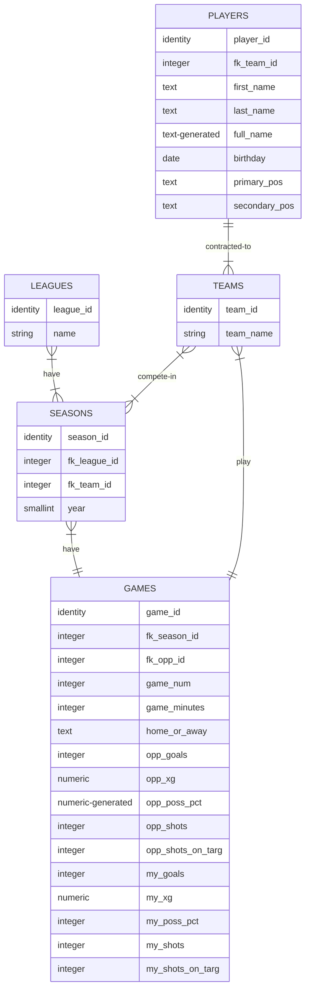

# fifa-career-mode-db
`postgres` database project, involving 3NF modeling for ingestion and analysis of FIFA video game career mode player stats.
 
 Runs as a container service using `docker-compose`
 

# Entity Relationship Diagram for Flask CRUD app

This ERD describes the physical data model behind the CRUD app, which is third-normal form.
 
