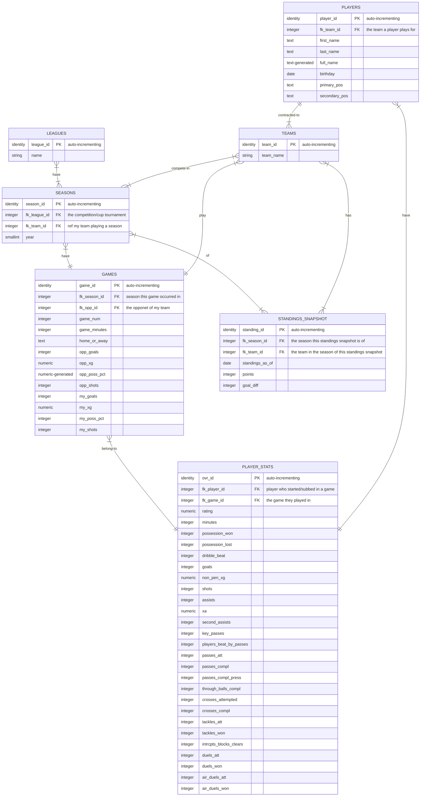

# fifa-career-mode-db
`postgres` database project, involving 3NF modeling for ingestion and analysis of FIFA video game career mode player stats.
 
 Runs as a container service using `docker-compose`
 

# Entity Relationship Diagram for Flask CRUD app

This ERD describes the physical data model behind the CRUD app, which is [third-normal form](https://en.wikipedia.org/wiki/Third_normal_form). 

The model tracks players and team stats I play with through each game in their leagues (domestic league, cup, continental tournaments) and seasons.

I used `mermaid.js`, a javascript based diagramming tool to mock up below. Resources for how to [build this ERD](https://mermaid-js.github.io/mermaid/#/entityRelationshipDiagram) and how to [render it in Github](https://github.blog/2022-02-14-include-diagrams-markdown-files-mermaid/)
 
